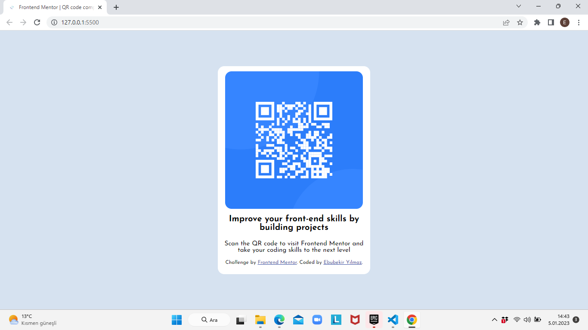

# Frontend Mentor - QR code component solution

This is a solution to the [QR code component challenge on Frontend Mentor](https://www.frontendmentor.io/challenges/qr-code-component-iux_sIO_H). Frontend Mentor challenges help you improve your coding skills by building realistic projects. 

## Table of contents

- [Screenshot](#screenshot)
- [Links](#links)
- [Built with](#built-with)
- [Author](#author)
- [Acknowledgments](#acknowledgments)

## Screenshot

## Links

- Solution URL: [Add solution URL here](https://your-solution-url.com)
- Live Site URL: [Add live site URL here](https://frontend-mentor-qr-jet.vercel.app/)

## Built with

- Semantic HTML5 markup
- CSS custom properties

## Author

- Linkedln - [Ebubekir Yılmaz](https://www.linkedin.com/in/ebubekir-yilmaz/)
- Frontend Mentor - [@Abou1205](https://www.frontendmentor.io/profile/Abou1205)
- Github - [@Abou1205](https://github.com/Abou1205)

